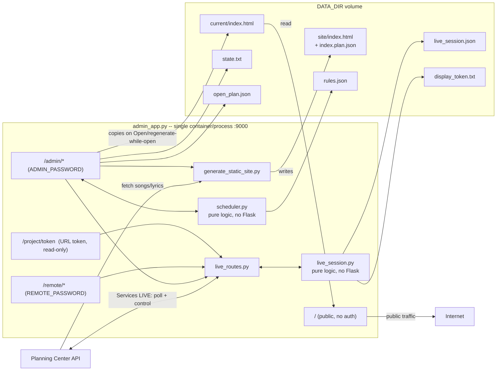

# Architecture: admin+web site

This covers the internals of the piece described in README.md's "Containerized deployment"
and "Automation" sections — how `admin_app.py`, `scheduler.py`, and `generate_static_site.py`
fit together, and why. It complements README.md (setup/usage) rather than repeating it. For
how this app is actually deployed in production (the real CT, Traefik route, secrets pipeline),
see `mikro-iac/docs/poc-lyrics.md` in the infrastructure repo — this doc stops at the container
boundary.

## Why this exists

Song lyrics are CCLI-licensed for the specific service they're used in, not for being publicly
readable all week. A plain "regenerate nightly, serve forever" static site (the old `texter`
deployment this app replaces) has no way to express that — the previous version of this idea
really did serve copyrighted lyrics publicly 24/7. `admin_app.py` makes "closed by default,
opened deliberately for a service" a first-class state instead of an afterthought: `/` always
reflects exactly what `state.txt`/`current/index.html` say, and only the `/admin` routes (and
the scheduler) can change that.

## One process, four route groups



The two features are independent: the open/closed state machine controls what the *public
website* serves, while a projection session controls what the *projector in the room* shows.
Starting a projection session does not open the public site, and vice versa — projecting lyrics
in the room during a service is the straightforwardly licensed use, whereas leaving them on a
public URL is the risk the open/closed toggle exists to manage.

- **`/`** (no auth): read-only, and the only thing it does is return whatever
  `DATA_DIR/current/index.html` currently holds. It has no logic of its own to distinguish
  "open" from "closed" — both are just different file contents it happens to be serving at the
  time. This asymmetry is deliberate: the CCLI-relevant decision logic lives in exactly one
  place (the `/admin` routes and the scheduler), and the public route can't be tricked into
  bypassing it because it has nothing to bypass.
- **`/admin/*`** (HTTP Basic Auth): the only routes with write access to `DATA_DIR`. Runs
  `generate_static_site.py` as a subprocess, serves the control UI, and — via the background
  scheduler thread the same process hosts — the automation described below.
- Both route groups run in the same Flask app/process and read/write the same `DATA_DIR`
  directly — no shared volume or network call between containers, because there's only one
  container. `/admin` is reachable at the same host/port as `/`; the deployment's Basic Auth
  is what gates it, not network placement (see `mikro-iac/docs/poc-lyrics.md` for how it's
  actually exposed).

**History note:** this used to be two containers (`admin` + a stock `web` static-file server)
communicating only through a shared volume, with `/admin` reachable only on the LAN. It was
collapsed into one process because the admin UI needed to be reachable from outside the LAN,
and the two-container split wasn't buying enough given how low-stakes a CCLI licensing lapse
on this site actually is (see git history for the prior topology if you need it).

## `DATA_DIR` layout

```
DATA_DIR/
├── site/
│   ├── index.html        latest output of generate_static_site.py
│   └── index.plan.json   {service_type_id, plan_id, plan_title} it was generated from
├── current/
│   └── index.html        what the "/" route actually serves (copy of site/ or the
│                          "come back Sunday" placeholder)
├── state.txt             "open" | "closed" (defaults to closed if missing/malformed)
├── open_plan.json        which plan is live right now + who opened it (see OpenPlan below)
├── rules.json            configured automation rules + last-evaluated bookkeeping
├── live_session.json     active projection session, if any (see Live projection below)
└── display_token.txt     the projector's bearer token
```

`site/` and `current/` are intentionally separate: **regenerate always refreshes `site/`**, but
only touches the public-facing `current/` if the site is currently open. This means clicking
"Regenerate now" mid-service to pull in a last-minute Planning Center edit doesn't risk
flashing the placeholder page at anyone mid-song — regeneration and publication are decoupled.

## State machine

Two independent-looking but coupled pieces of state:

1. **`state.txt`**: `open` or `closed`. Determines what `current/index.html` contains.
2. **`open_plan.json`** (`OpenPlan` dataclass, `scheduler.py`): only meaningful when state is
   `open`. Records *which* plan is live and — critically — `opened_by: "manual" | "automation"`.
   Automation windows also carry `window_ends_at`; manual opens don't (a human closes it when
   they close it).

All four mutating routes (`/admin/regenerate`, `/admin/open`, `/admin/close`, and the
scheduler's own tick) go through a single `threading.Lock` (`admin_app._lock`) —
`app.run(threaded=True)` means each HTTP request is its own thread, running concurrently with
the scheduler's background thread, and all of them touch the same on-disk files. The public
`/` route only reads `current/index.html` and isn't part of this locking — a regenerate/open/
close racing a request can at worst serve the version of the file from just before or just
after the write, never a torn one (each write is a single `Path.write_text` call).

**Self-healing**: every scheduler tick starts by checking for a stale `open_plan.json` while
`state.txt` says closed (a crash mid-write, or someone hand-editing `state.txt`) and clears it
before doing anything else — otherwise a stale record could confuse the auto-close timer or the
"who opened this" logic.

## Automation (`scheduler.py`)

Deliberately has **no Flask, HTTP, or threading** in it — pure logic + JSON persistence, so
it's unit-testable without a running server (`tests/test_scheduler.py`). `admin_app.py` owns
the actual background thread (`_scheduler_loop`, sleeps `SCHEDULER_POLL_SECONDS`, default 300)
and the open/close state machine (`_tick`); `scheduler.evaluate_rule` only ever *decides*, never
*acts*.

**The guardrail** (`evaluate_rule` → `_is_sane_window`) exists because real Planning Center data
on this account has produced exact 0-duration placeholder time windows sitting right next to
legitimate ones in the same service type. A rule only fires if:
- today's plan for that service type exists and has at least one song item,
- it has a `plan_times` row (preferring `time_type == "service"`, but falling back to any row
  since this account tags placeholders the same way),
- that window's duration is sane (configurable `min_window_minutes`/`max_window_minutes`,
  defaults 15min–12h — generous on purpose) and starts on the expected local date.

Anything that fails is recorded as `skipped` with the specific reason, visible on
`/admin/settings` — automation never guesses; it either has a plan it trusts or it does nothing.

### Planning Center's plan-time data model, and how to schedule a plan correctly

A Planning Center plan does **not** carry an independent "date" field you set directly. What
looks like a date (`attributes.dates`, e.g. `"23 July 2026"`, or `"No dates"` for a plan with
none) is a *display string computed from the plan's `PlanTime` rows* — Service Time, Rehearsal
Time, or Other Time blocks you add from the plan's "Times" tab in the Services UI. No PlanTime
rows means no date, no matter what the plan's title or position in a series implies.

**To make a plan discoverable by date (and therefore automatable), it needs an actual PlanTime**
with the real start/end on the intended day — not just existing under the right service type.
Creating a plan and leaving its Times tab empty produces a plan `find_plan_by_date` (and the
scheduler built on it) can never correctly place.

**The pitfall this caused (found 2026-07-23, fixed in `pco_client.find_plan_by_date`):** for a
plan with zero PlanTime rows, Planning Center's API doesn't return a null/empty `sort_date` — it
fills in the timestamp of *whenever you happened to call the API*, confirmed by re-fetching the
same plan a few seconds apart and watching `sort_date` tick forward with it. That means a
dateless draft plan left over in a service type spuriously matches **today's date on every single
lookup, every single day, forever** — and if it sorts earlier in the API's response than a real
dated plan for the same day, `find_plan_by_date` (which used to take the first string-prefix
match with no other filtering) would return the ghost plan and never reach the real one. This is
exactly what happened to the "Special Events" service type on this account: it had accumulated
several old dateless plans (leftover drafts/one-offs, e.g. `"Kingdom Intensive Okt 21"`,
`"Weekend25 Fredag Kväll"`), and one of them permanently shadowed a real plan created for
2026-07-23.

The fix: `find_plan_by_date` now skips any plan whose
`service_time_count + rehearsal_time_count + other_time_count == 0` before checking `sort_date`
at all — those three counts are returned directly on the plan resource, so this needs no extra
API call. A plan with no scheduled time literally cannot answer "what's the plan for this date,"
so excluding it is correct, not a workaround for bad data — but it's also why the guardrail in
`evaluate_rule` (above) is deliberately layered on top rather than trusting *any* single field:
Planning Center data on this account has repeatedly turned out to need cross-checking, not blind
trust, at more than one layer.

**Checklist for a plan you expect a rule to pick up:**
1. Plan exists under the rule's configured service type.
2. Plan has at least one song item.
3. Plan's Times tab has a real Service Time (or Rehearsal/Other) block with the correct date and
   a plausible (non-zero, non-multi-day) duration — this is what ends up in `plan_times` /
   `dates` / `sort_date`; skipping this step is the single most common way a plan silently fails
   to be picked up.
4. If it's still not firing, check `/admin/settings` for that rule's `last_action`/`last_reason`
   — every skip is logged there with the specific guardrail that rejected it, so start there
   before reaching for the API directly.

**Priority rule, enforced by `_tick`'s own control flow, not a special case**: manual actions
(the three UI buttons under `/admin`) always win immediately. Automation only ever opens when the site is
closed *and* nothing is already tracked as live; it only ever auto-closes a window it opened
itself (checked via `open_plan.opened_by == "automation"`) — it will never re-open something a
human just closed or auto-close something a human opened manually, because those states simply
never match automation's own preconditions.

## Live projection (`live_session.py` + `live_routes.py`)

A second feature sharing the same process and `DATA_DIR`: a projector and a remote for an
actual service, synced to Planning Center's own **Services LIVE** session (the thing a worship
leader drives from the Services app). Same split as the scheduler — `live_session.py` is pure
logic + JSON persistence with no Flask in it; `live_routes.py` owns the HTTP surface.

```
DATA_DIR/
├── live_session.json    active projection session (plan ref, mode, theme)
└── display_token.txt    the projector's bearer token
```

**Reading what's live is a two-hop indirection.** The `live` resource doesn't report the
current *Item*; it reports a `current_item_time` relationship pointing at an **ItemTime**, and
only the sideloaded ItemTime carries the link back to the plan item. `pco_client.get_live_status`
does that resolution behind `include=current_item_time,next_item_time,controller` and hands
callers plain item ids. This is also why `SongLyrics` gained an `item_id`: `collect_songs`
previously discarded it, and without it there's no way to answer "is this the song on screen".

**Follow vs. control.** A session always starts in `follow` mode, where the app has never
written to Planning Center — it polls and mirrors, and whoever holds control keeps it.
`control` mode is entered only through a confirmed click on `/admin/live`. This matters because
Planning Center allows **exactly one controller per plan**, and `toggle_control` boots the
incumbent with no warning on their end. Nothing takes control implicitly: not a page load, not
a timer, not a Next press (`_require_control` returns 409 in follow mode rather than silently
escalating). Stopping a session releases control, so it isn't left parked on a projector after
the service.

**Why the projector shows a blank rather than the last song**: Services LIVE walks the whole
running order, so the current item is regularly a sermon or an announcement. `resolve_display`
distinguishes four cases — `song`, `hold` (a known non-song item → blank), `waiting` (nothing
live yet), and `stale` (Planning Center unreachable, or on an item this session's cache predates
→ *keep the last frame*, since blanking a projector mid-song is worse than a few seconds of
staleness). All four are unit-tested in `tests/test_live_session.py`.

**Poll cost is fixed, not per-viewer.** The projector polls every 1.5s and the remote every 2s,
and a church may have several of each open. `live_routes.poll_live` caches the Planning Center
read for `LIVE_POLL_CACHE_SECONDS`, so API traffic doesn't scale with the number of open tabs
and can't walk into a rate limit mid-service. The projector's polling path also deliberately
avoids `admin_app._lock`, so it can't block behind a regenerate subprocess.

**Tap-to-jump is a walk, not a seek.** Services LIVE exposes only `go_to_next_item` /
`go_to_previous_item` — there is no absolute "go to item X". `steps_between` computes the delta
across the *full* running order (a song-to-song jump usually crosses non-song items), and
`MAX_JUMP_STEPS` caps how far one tap will walk so a mis-tap can't fire an unbounded burst of
writes.

## Auth

Three credentials with three different jobs, all dispatched from the single `_require_auth`
hook (`@app.before_request`) so every route's answer to "who gets in" is readable in one place:

| Route | Gate | Write access |
|---|---|---|
| `/`, `/healthz` | none | none |
| `/project/<token>` | token in the URL, checked in-route | **none** — no POST route exists under `/project` |
| `/remote/*` | `REMOTE_PASSWORD` (separate credential) | drives Planning Center, control mode only |
| `/admin/*` | `ADMIN_PASSWORD` | everything |

`/remote` gets its own password rather than reusing the admin one because the person running a
service from the back of the room shouldn't hold the credential that can publish copyrighted
lyrics to the internet. An unset `REMOTE_PASSWORD` makes `/remote` return **503, not open** —
missing config must never mean "no auth required".

The projector gets a **token in its URL instead of a password** because it's an unattended
browser on a booth machine several people can walk up to, with no practical way to log it out
after a service. The token is rotatable from `/admin/live` (invalidating every existing display
URL at once), and every route it reaches is a GET, so a leaked link can't advance the plan, take
Planning Center control, or open the public site. The tradeoff, accepted deliberately: a URL
token lands in browser history and proxy access logs. That's tolerable for a page whose entire
content is lyrics the congregation is already looking at — it is **not** a pattern to extend to
`/admin`. A wrong token returns 404, identical to an unknown URL, so probing can't confirm a
display URL exists.

Credential comparisons all use `secrets.compare_digest` (constant-time,
avoids a timing side-channel on the credential comparison). There is **no rate limiting or lockout** on failed attempts —
acceptable given the password is a long random string (see the mikro-iac deployment's secret
generation), not something meant to be human-memorable, but worth knowing if this ever moves to
a weaker/user-chosen password. The app refuses to even start (`main()`) without
`PLANNING_CENTER_APP_ID`/`SECRET` and `ADMIN_PASSWORD` set — there's no unauthenticated fallback
mode.

Basic Auth itself is not encrypted; the app relies entirely on TLS being terminated in front of
it (a reverse proxy — Traefik in the mikro-iac deployment). It is not safe to expose this
directly over plain HTTP. Since `/admin` is now reachable at the same public host/port as `/`
(see the history note above), Basic Auth is the *only* gate on it — there's no network-level
restriction (LAN-only, IP allowlist) backing it up unless the deployment adds one at the reverse
proxy. That's an accepted tradeoff here: the content this whole app protects is CCLI-licensed
lyrics, not sensitive data, so the admin UI needing to be reachable from outside the LAN mattered
more than keeping a second layer of network-level isolation on top of the password.

## `pco_client` (`src/pco_client/`)

Thin wrapper around the Planning Center Services REST API shared by every tool in this repo
(this admin app, the Notion export, the experimental remote display). Handles Basic Auth session
setup, pagination (`api_get_all_pages`), and plan/song/arrangement lookups. `scheduler.py` uses
`find_plan_by_date` + `get_plan_items` + `get_plan_times`; `generate_static_site.py` uses
`find_upcoming_plan`/`find_plan_by_date` + `collect_songs` for the actual lyrics rendering;
`live_routes.py` uses `get_live_status` + `live_take_control`/`live_go_to_*` and
`get_plan_item_summaries`. Nothing here is admin/web-app-specific — it has no knowledge of
`DATA_DIR`, auth, or the open/closed concept.

`get_live_status` never raises: it's on a path polled every couple of seconds by a projector
mid-service, so a transient failure returns `reachable=False` for the caller to hold its last
frame, rather than an exception that would blank a screen. `live_take_control` /
`live_release_control` read state before acting, because Planning Center only offers a raw
`toggle_control` — a blind second call would hand control straight back.

## CI / build pipeline (`.github/workflows/docker-build.yml`)

Three jobs on every push/PR to `main`:

- **`build`**: builds `static-site/Dockerfile` (confirms it still builds after a
  Dockerfile/dependency change) — not pushed anywhere by this job.
- **`test`**: `uv run pytest` — the scheduler/state-machine logic
  (`tests/test_scheduler.py`, `tests/test_admin_state_machine.py`), the Planning Center client
  including the Services LIVE response shapes (`tests/test_pco_client.py`), and the live
  projection logic and route/auth boundaries (`tests/test_live_session.py`,
  `tests/test_live_routes.py`).
- **`publish`**: **push events to `main` only**, gated on `build`+`test` both passing. Builds
  and pushes the image to `ghcr.io/jswetzen/planning-center-lyrics`, tagged `:main` (moving) and
  `:sha-<commit>` (pinned).

This is the only path production images reach GHCR — there's no manual `docker push` step
documented or expected.
