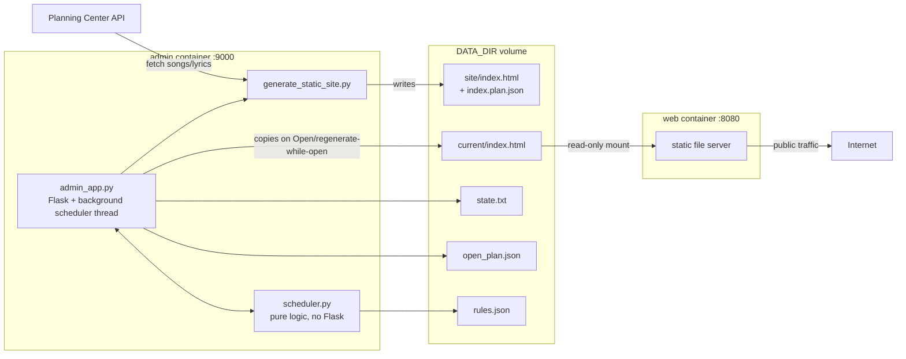

# Architecture: containerized admin/web site

This covers the internals of the piece described in README.md's "Containerized deployment"
and "Automation" sections — how `admin_app.py`, `scheduler.py`, and `generate_static_site.py`
fit together, and why. It complements README.md (setup/usage) rather than repeating it. For
how this app is actually deployed in production (the real CT, Traefik route, secrets pipeline),
see `mikro-iac/docs/poc-lyrics.md` in the infrastructure repo — this doc stops at the container
boundary.

## Why this exists

Song lyrics are CCLI-licensed for the specific service they're used in, not for being publicly
readable all week. A plain "regenerate nightly, serve forever" static site (the old `texter`
deployment this app replaces) has no way to express that — the previous version of this idea
really did serve copyrighted lyrics publicly 24/7. Splitting the app into an **admin** control
plane and a **web** data plane makes "closed by default, opened deliberately for a service" a
first-class state instead of an afterthought.

## Two containers, one shared data directory



- **admin** (`admin_app.py`, port 9000): the only thing with write access to `DATA_DIR`. Runs
  `generate_static_site.py` as a subprocess, serves the HTTP Basic Auth-gated control UI, and
  hosts the background scheduler thread (see below).
- **web** (port 8080): a plain static file server with **no application logic at all** — it
  just serves whatever `DATA_DIR/current/index.html` currently contains, read-only. It cannot
  distinguish "open" from "closed"; both are just static HTML files. This asymmetry is
  deliberate: the CCLI-relevant decision logic lives in exactly one place (admin), and the
  public-facing tier is as simple and low-risk as possible.
- They communicate **only** through the shared `DATA_DIR` volume, never a network call between
  the two containers.

**Local dev vs. production note:** `Dockerfile.web` + `nginx.conf` in this repo build the web
image used by `compose.yaml` for local `podman compose up`. The actual production deployment
(`mikro-iac`, CT `poc-lyrics`) does **not** use this image — it runs a stock `caddy:2` image
instead, configured via Nix rather than this repo's Dockerfile. Functionally equivalent (serve
`current/index.html` read-only), but if you're debugging a production web-tier issue, the
config you want is in `mikro-iac/apps/poc-lyrics.nix`, not `static-site/nginx.conf`.

## `DATA_DIR` layout

```
DATA_DIR/
├── site/
│   ├── index.html        latest output of generate_static_site.py
│   └── index.plan.json   {service_type_id, plan_id, plan_title} it was generated from
├── current/
│   └── index.html        what the web container actually serves (copy of site/ or the
│                          "come back Sunday" placeholder)
├── state.txt             "open" | "closed" (defaults to closed if missing/malformed)
├── open_plan.json        which plan is live right now + who opened it (see OpenPlan below)
└── rules.json            configured automation rules + last-evaluated bookkeeping
```

`site/` and `current/` are intentionally separate: **regenerate always refreshes `site/`**, but
only touches the public-facing `current/` if the site is currently open. This means clicking
"Regenerate now" mid-service to pull in a last-minute Planning Center edit doesn't risk
flashing the placeholder page at anyone mid-song — regeneration and publication are decoupled.

## State machine

Two independent-looking but coupled pieces of state:

1. **`state.txt`**: `open` or `closed`. Determines what `current/index.html` contains.
2. **`open_plan.json`** (`OpenPlan` dataclass, `scheduler.py`): only meaningful when state is
   `open`. Records *which* plan is live and — critically — `opened_by: "manual" | "automation"`.
   Automation windows also carry `window_ends_at`; manual opens don't (a human closes it when
   they close it).

All four mutating routes (`/regenerate`, `/open`, `/close`, and the scheduler's own tick) go
through a single `threading.Lock` (`admin_app._lock`) — `app.run(threaded=True)` means each
HTTP request is its own thread, running concurrently with the scheduler's background thread,
and all of them touch the same on-disk files.

**Self-healing**: every scheduler tick starts by checking for a stale `open_plan.json` while
`state.txt` says closed (a crash mid-write, or someone hand-editing `state.txt`) and clears it
before doing anything else — otherwise a stale record could confuse the auto-close timer or the
"who opened this" logic.

## Automation (`scheduler.py`)

Deliberately has **no Flask, HTTP, or threading** in it — pure logic + JSON persistence, so
it's unit-testable without a running server (`tests/test_scheduler.py`). `admin_app.py` owns
the actual background thread (`_scheduler_loop`, sleeps `SCHEDULER_POLL_SECONDS`, default 300)
and the open/close state machine (`_tick`); `scheduler.evaluate_rule` only ever *decides*, never
*acts*.

**The guardrail** (`evaluate_rule` → `_is_sane_window`) exists because real Planning Center data
on this account has produced exact 0-duration placeholder time windows sitting right next to
legitimate ones in the same service type. A rule only fires if:
- today's plan for that service type exists and has at least one song item,
- it has a `plan_times` row (preferring `time_type == "service"`, but falling back to any row
  since this account tags placeholders the same way),
- that window's duration is sane (configurable `min_window_minutes`/`max_window_minutes`,
  defaults 15min–12h — generous on purpose) and starts on the expected local date.

Anything that fails is recorded as `skipped` with the specific reason, visible on `/settings` —
automation never guesses; it either has a plan it trusts or it does nothing.

**Priority rule, enforced by `_tick`'s own control flow, not a special case**: manual actions
(the three UI buttons) always win immediately. Automation only ever opens when the site is
closed *and* nothing is already tracked as live; it only ever auto-closes a window it opened
itself (checked via `open_plan.opened_by == "automation"`) — it will never re-open something a
human just closed or auto-close something a human opened manually, because those states simply
never match automation's own preconditions.

## Auth

Every route except `/healthz` goes through `_require_auth` (`@app.before_request`), checked with
`secrets.compare_digest` (constant-time, avoids a timing side-channel on the credential
comparison). There is **no rate limiting or lockout** on failed attempts — acceptable given the
password is a long random string (see the mikro-iac deployment's secret generation), not
something meant to be human-memorable, but worth knowing if this ever moves to a
weaker/user-chosen password. The app refuses to even start (`main()`) without
`PLANNING_CENTER_APP_ID`/`SECRET` and `ADMIN_PASSWORD` set — there's no unauthenticated fallback
mode.

Basic Auth itself is not encrypted; the app relies entirely on TLS being terminated in front of
it (a reverse proxy — Traefik in the mikro-iac deployment). It is not safe to expose this
directly over plain HTTP.

## `pco_client` (`src/pco_client/`)

Thin wrapper around the Planning Center Services REST API shared by every tool in this repo
(this admin app, the Notion export, the experimental remote display). Handles Basic Auth session
setup, pagination (`api_get_all_pages`), and plan/song/arrangement lookups. `scheduler.py` uses
`find_plan_by_date` + `get_plan_items` + `get_plan_times`; `generate_static_site.py` uses
`find_upcoming_plan`/`find_plan_by_date` + `collect_songs` for the actual lyrics rendering.
Nothing here is admin/web-app-specific — it has no knowledge of `DATA_DIR`, auth, or the
open/closed concept.

## CI / build pipeline (`.github/workflows/docker-build.yml`)

Three jobs on every push/PR to `main`:

- **`build`**: matrix-builds both `Dockerfile.admin` and `Dockerfile.web` (confirms they still
  build after a Dockerfile/dependency change) — neither is pushed anywhere by this job.
- **`test`**: `uv run pytest` — currently the scheduler/state-machine logic
  (`tests/test_scheduler.py`, `tests/test_admin_state_machine.py`).
- **`publish`**: **push events to `main` only**, gated on `build`+`test` both passing. Builds
  and pushes *only* the admin image (`Dockerfile.admin`) to `ghcr.io/jswetzen/planning-center-lyrics`,
  tagged `:main` (moving) and `:sha-<commit>` (pinned). The web image is never published —
  production doesn't use this repo's web image at all (see the caddy:2 note above), so there's
  nothing to publish it for.

This is the only path production images reach GHCR — there's no manual `docker push` step
documented or expected.
